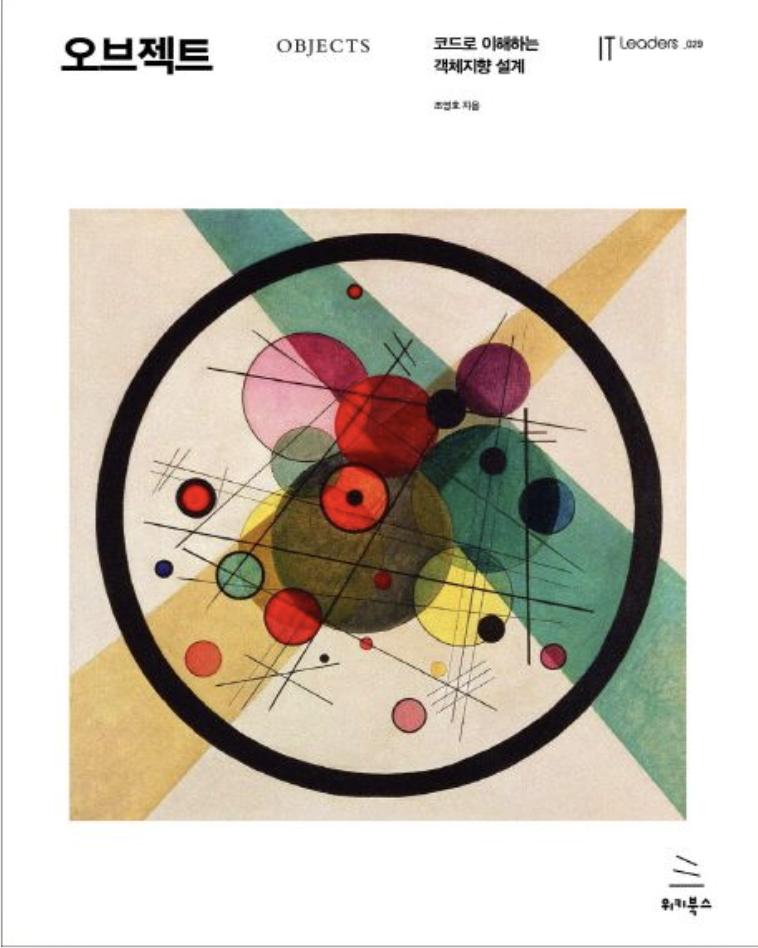

<div align="center">
  
</div>

# 📖 오브젝트 - 코드로 이해하는 객체지향 설계

> Claude AI와 함께 정리한 객체지향 설계 학습 저장소

[](https://github.com/dev-book-lab/object)


---

## 📖 소개

이 저장소는 조영호 님의 "오브젝트: 코드로 이해하는 객체지향 설계" 책을 학습하면서 작성한 정리 노트입니다.

- 🤖 AI(Claude)를 활용한 심층적인 개념 설명
- 💻 단계별 리팩토링 과정 분석
- 📝 한국어로 작성된 자세한 설명
- 🔍 "왜?"에 대한 깊이 있는 탐구

> *"이론이 먼저가 아니라 코드가 먼저다"*

<br/>

**🔗 [Dev Book Lab](https://github.com/dev-book-lab) - AI와 함께하는 개발 서적 연구소**

---

## 🎯 이 책에 대하여

"오브젝트"는 객체지향 설계의 이론과 실무를 연결하는 가교 역할을 하는 책입니다.

단순히 디자인 패턴을 암기하거나 원칙을 나열하는 것이 아니라, **왜 그런 설계를 해야 하는지**, **어떻게 변경 가능한 코드를 만들 수 있는지**를 구체적인 예제 코드를 통해 보여줍니다.

### ✨ 학습 목표

- 객체지향 설계의 핵심 개념 이해: **역할, 책임, 협력**
- **변경에 유연한** 설계 만들기
- 설계 트레이드오프를 통한 **실용적 판단력** 기르기
- 코드 리팩토링을 통한 설계 개선 경험

---

## 📚 목차

각 챕터는 독립적인 학습 문서를 포함하고 있으며, 코드 예제와 함께 핵심 개념을 정리했습니다.

| Chapter | 주제 | 핵심 키워드 |
|:-------:|------|------------|
| **[01](./chapter01/README.md)** | 객체, 설계 | 의존성, 결합도, 응집도, 캡슐화 |
| **[02](./chapter02/README.md)** | 객체지향 프로그래밍 | 협력, 메시지, 다형성 |
| **[03](./chapter03/README.md)** | 역할, 책임, 협력 | 책임 주도 설계 |
| **[04](./chapter04/README.md)** | 설계 품질과 트레이드오프 | 데이터 중심 vs 책임 중심 설계 |
| **[05](./chapter05/README.md)** | 책임 할당하기 | GRASP 패턴 |
| **[06](./chapter06/README.md)** | 메시지와 인터페이스 | 퍼블릭 인터페이스 설계 |
| **[07](./chapter07/README.md)** | 객체 분해 | 프로시저 추상화, 데이터 추상화 |
| **[08](./chapter08/README.md)** | 의존성 관리하기 | 의존성 역전 원칙 |
| **[09](./chapter09/README.md)** | 유연한 설계 | 개방-폐쇄 원칙 |
| **[10](./chapter10/README.md)** | 상속과 코드 재사용 | 합성 vs 상속 |
| **[11](./chapter11/README.md)** | 합성과 유연한 설계 | 믹스인, 인터페이스 |
| **[12](./chapter12/README.md)** | 다형성 | 상속, 오버로딩, 제네릭 |
| **[13](./chapter13/README.md)** | 서브클래싱과 서브타이핑 | 리스코프 치환 원칙 |
| **[14](./chapter14/README.md)** | 일관성 있는 협력 | 협력 패턴 |
| **[15](./chapter15/README.md)** | 디자인 패턴과 프레임워크 | GoF 패턴, 프레임워크 |

> 📝 **Note**: 각 챕터의 README.md는 순차적으로 업데이트됩니다.

---

## 🎯 학습 방법

```
📖 Read → 🤖 AI Analysis → 💭 Deep Dive → 💻 Practice → 📝 Document
```

1. **개념 학습**: 각 Chapter의 `README.md` 읽기
2. **코드 분석**: 리팩토링 전/후 코드 비교
3. **AI 대화**: 궁금한 점을 AI와 대화하며 해소
4. **실습**: 코드를 직접 수정하고 실험
5. **문서화**: 이해한 내용을 자신의 언어로 정리

### 📖 각 챕터 구성

각 챕터 문서는 다음과 같은 구조로 구성됩니다:

| 섹션 | 설명 |
|------|------|
| 📌 **핵심 개념** | 챕터의 주요 학습 내용 |
| 🎯 **학습 목표** | 이 챕터를 통해 얻을 수 있는 것 |
| 💻 **코드 분석** | 리팩토링 전/후 비교 및 설계 개선 과정 |
| 🤔 **깊이 파기** | AI와 대화하며 발견한 통찰 |
| ✨ **핵심 정리** | 실전에 적용할 수 있는 원칙 |

---

## 💻 시작하기

### 📋 필요 사항
- **Java 21** 이상
- **IntelliJ IDEA** (권장) 또는 다른 Java IDE

### 1️⃣ Repository 클론
```bash
git clone https://github.com/dev-book-lab/object.git
cd object
```

### 2️⃣ 코드 예제 확인

각 챕터별로 단계적인 리팩토링 과정을 확인할 수 있습니다:

```
chapter01/
├── README.md                    # 챕터 학습 문서
└── src/main/java/org/eternity/theater/
    ├── step01/                  # 초기 설계 (절차지향적)
    ├── step02/                  # 1차 리팩토링 (캡슐화)
    └── step03/                  # 2차 리팩토링 (트레이드오프)
```

### 3️⃣ 학습 순서

1. 해당 챕터의 `README.md` 읽기
2. `step01` 코드 분석 (문제점 파악)
3. `step02`, `step03` 코드 비교 (개선 과정 이해)
4. 직접 코드를 수정하며 실험

> 💡 **Tip**: 각 step의 코드는 독립적으로 실행 가능하며, IntelliJ에서 바로 실행할 수 있습니다.

---

## 🛠️ 코드 예제

책의 모든 코드 예제는 [원저자의 GitHub 저장소](https://github.com/eternity-oop/object)에서 가져왔으며, 각 챕터별로 단계적인 리팩토링 과정을 확인할 수 있습니다.

---

## 📝 작성 방식

- ✅ 책 내용 + AI를 통한 심층 분석
- ✅ 실무 관점의 추가 설명과 예제
- ✅ "왜?"에 대한 질문과 답변
- ✅ 단계별 리팩토링 과정 상세 분석
- ✅ 설계 트레이드오프 설명

---

## 🤝 기여하기

1. Fork the repository
2. Create your feature branch (`git checkout -b feature/AmazingFeature`)
3. Commit your changes (`git commit -m 'Add some AmazingFeature'`)
4. Push to the branch (`git push origin feature/AmazingFeature`)
5. Open a Pull Request

---

## 🙏 Reference

- **원서**: [오브젝트: 코드로 이해하는 객체지향 설계](http://www.yes24.com/Product/Goods/74219491) - 조영호 저, 위키북스
- **원서 코드**: [eternity-oop/object](https://github.com/eternity-oop/object)
- **저자 블로그**: [Eternity's Chit-Chat](https://eternity-object.tistory.com/)
- **관련 서적**: 『객체지향의 사실과 오해』 - 조영호 저

---

## ✨ Author

AI와 대화하며 기술을 깊이 이해하는 개발자의 학습 기록

---

<div align="center">

**⭐️ 도움이 되셨다면 Star를 눌러주세요!**

Made with ❤️ and 🤖

*설계는 트레이드오프의 산물이다*

</div>
